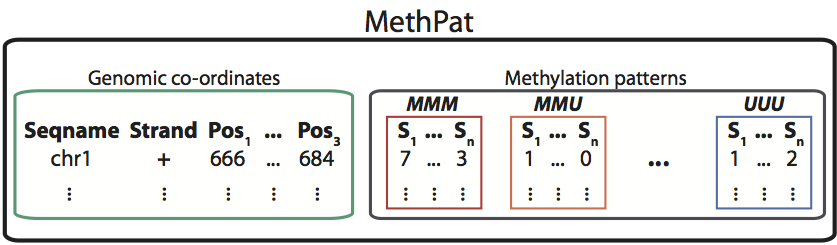
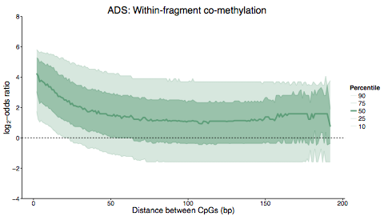

```{r, echo = FALSE}
knitr::opts_chunk$set(comment = ">#")
```

## Motivation {.smaller .build}

> - Analysing counts of methylation patterns at genomic tuples
> - Counts extracted from `BAM` file using `methtuple` ([https://github.com/PeteHaitch/methtuple](https://github.com/PeteHaitch/methtuple); Python)

__Example output of `methtuple` for 3-tuples__

```
chr     strand  pos1    pos2    pos3    MMM     MMU     MUM     MUU     UMM     UMU     UUM     UUU
chr1    +       781154  781161  781190  4       1       0       0       0       0       0       0
chr1    +       781362  781406  781455  0       0       1       1       0       0       0       0
chr1    +       781616  781720  781732  0       0       1       0       0       1       1       1
chr1    +       781616  781763  781795  0       0       0       0       1       0       0       0
chr1    +       781720  781732  781738  0       1       2       1       4       0       1       0
chr1    +       781732  781738  781763  3       0       0       1       0       2       1       0
chr1    +       781738  781763  781795  0       0       0       0       0       1       0       0
chr1    +       781738  781763  781912  0       1       0       0       0       0       0       0
chr1    +       781763  781795  781912  0       0       0       1       0       0       1       0
chr1    +       781912  781989  782013  1       0       1       1       0       0       1       0
chr1    +       781912  782013  782024  3       0       0       0       0       0       0       0
chr1    +       781989  782013  782024  2       0       3       0       3       0       3       0
chr1    +       782013  782024  782048  2       2       0       0       3       2       0       0
chr1    +       782236  782243  782268  1       0       1       0       0       1       0       0
```

## Aim {.build}



__`MethPat` implemented in `MethylationTuples`__

* `MethPat` extends `GenomicRanges::SummarizedExperiment`

## Genomic tuples {.build}

```
chr     strand  pos1    pos2    pos3
chr1    +       781154  781161  781190
chr1    +       781362  781406  781455
chr1    +       781616  781720  781732
chr1    +       781616  781763  781795
chr1    +       781720  781732  781738
```

__`GenomicTuples`__

* Extend `GenomicRanges` to _genomic tuples_
* Retains a familiar interface

## `GTuples` 

```{r, message = FALSE}
library(GenomicTuples)
# Create a GTuples object with two 3-tuples
seqinfo <- Seqinfo("chr1", 1000, NA, "toy")
gt <- GTuples(seqnames = 'chr1', 
              ### <b>
             tuples = matrix(c(1L, 5L, 5L, 10L, 10L, 20L), ncol = 3), 
              ### </b>
              strand = "+", 
              seqinfo = seqinfo)
gt
```

## `GTuples` extends `GRanges` {.build}

```{r, eval = FALSE}
setClass("GTuples",
         contains = "GRanges",
         representation(
           internalPos = "matrixOrNULL", 
           size = "integer"),
         prototype(
           internalPos = NULL,
           size = NA_integer_)
)
```

```{r, eval = FALSE}
# Ensure the internalPos slot "sticks" during subsetting, etc.
setMethod(GenomicRanges:::extraColumnSlotNames, 
          "GTuples",
          function(x) {
            c("internalPos")
          }
)
```

## Useful `GTuples` methods (inherited)

```{r}
seqnames(gt)
strand(gt)
```

## Useful `GTuples` methods (new)

```{r}
size(gt)
tuples(gt)
IPD(gt) # IPD = intra-pair distances
```

## Ill-defined `GTuples` methods {.build}

__These return errors__

* `coverage`
* `flank`, `promoters`, `resize`, `narrow` 
* `disjoin`, `gaps`, `isDisjoint`, `range`, `reduce`
* `mapCoords`
* `Ops`, `intersect`, `pgap`, `pintersect`, `psetdiff`, `punion`, `setdiff`, `union`, `tile`

Meaningful definitions (and pull requests) are welcomed!

## `GTuples` comparison and sorting

```{r, echo = FALSE}
gt3 <- GTuples(seqnames = c('chr1', 'chr1', 'chr1', 'chr1', 'chr2', 'chr1', 
                            'chr1'), 
               tuples = matrix(c(10L, 10L, 10L, 10L, 10L, 5L, 10L, 20L, 20L, 
                                 20L, 25L, 20L, 20L, 20L, 30L, 30L, 35L, 30L, 
                                 30L, 30L, 35L), 
                               ncol = 3), 
               strand = c('+', '-', '*', '+', '+', '+', '+'))
```

```{r}
# Sorted first by seqnames, then by strand, then by tuples
sort(gt3)
```

## `findOverlaps`-based methods

```{r, eval = FALSE}
if (size < 3) {
  # Treat GTuples as GRanges
} else {
  if (type == "equal") {
    # Call .findEqual.GTuples()
  } else {
    # Treat GTuples as GRanges
  }
}
```

## `GenomicTuples` summary {.build}

A drop in replacement for `GenomicRanges` when you have genomic _tuples_ rather than _ranges_.

__Limitations__

* All tuples in a `GTuples` object must have same `size`
* Room for improvement with `findOverlaps(x, y, type = 'equal')`
    + Performance
    + Not all options supported (e.g., `maxgap` and `minoverlap`)

## `MethylationTuples` {.build}

An R package for analysing, managing and visualising methylation patterns at genomic tuples.

<div class="columns-2">

__Analyses__

* Epialleles
* Methylation entropy
* Allele-specific methylation
* Co-methylation



</div>

## `MethylationTuples` development {.build}

> - Adding additional features and tests, improving documentation and adding vignette
> - __Performance__: `MethPat` objects become increasingly sparse as `size` increases (and as $n_{samples}$ increases)
     
__12 whole-genome bisulfite-sequencing samples__

|          | `pryr::object_size(x)` | `nrow`        | Number of assays | Percentage of `NA` and $0$ values |
|----------|------------------------|---------------|------------------|------------------------------------------|
| 1-tuples | $5.9$ GB               | $56,348,522$  | $2$              | $28\%$                                   |
| 2-tuples | $20.1$ GB              | $100,586,237$ | $4$              | $80\%$                                   |
| 3-tuples | $43.3$ GB              | $109,376,348$ | $8$              | $93\%$                                   |
| 4-tuples | $80.5$ GB              | $102,625,758$ | $16$             | $97\%$                                     |

## Thanks

__PhD advisors__

* Terry Speed
* Peter Hall

__Programming__

* Hervé Pagès
* Martin Morgan
* Michael Lawrence
* R/BioC community

__Funding__

* Edith Moffat Travel Award

## Links

* [Slides.Rmd (https://github.com/PeteHaitch/BiocEurope_2015_presentation)](https://github.com/PeteHaitch/BiocEurope_2015_presentation)
* __GitHub__: [\@PeteHaitch](https://github.com/PeteHaitch/)
    + [`GenomicTuples` (release)](http://bioconductor.org/packages/release/bioc/html/GenomicTuples.html)
    + [`GenomicTuples` (GitHub devel)](https://github.com/PeteHaitch/GenomicTuples)
    + [`MethylationTuples` (GitHub devel)](https://github.com/PeteHaitch/MethylationTuples)
* __Twitter__: [\@PeteHaitch](https://twitter.com/PeteHaitch)
